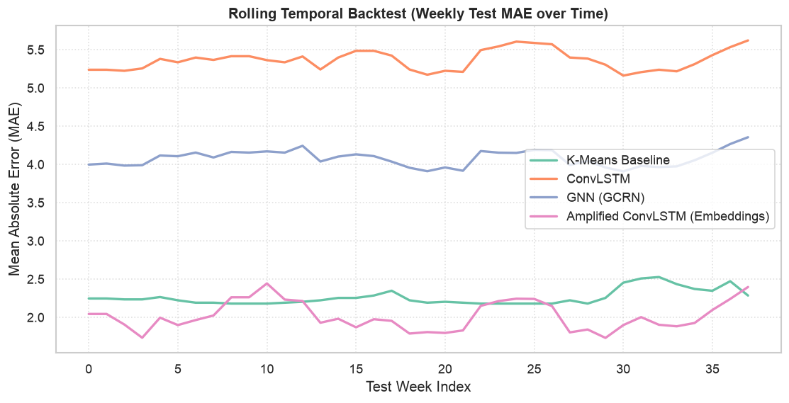
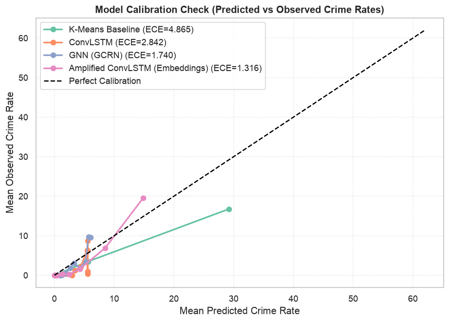
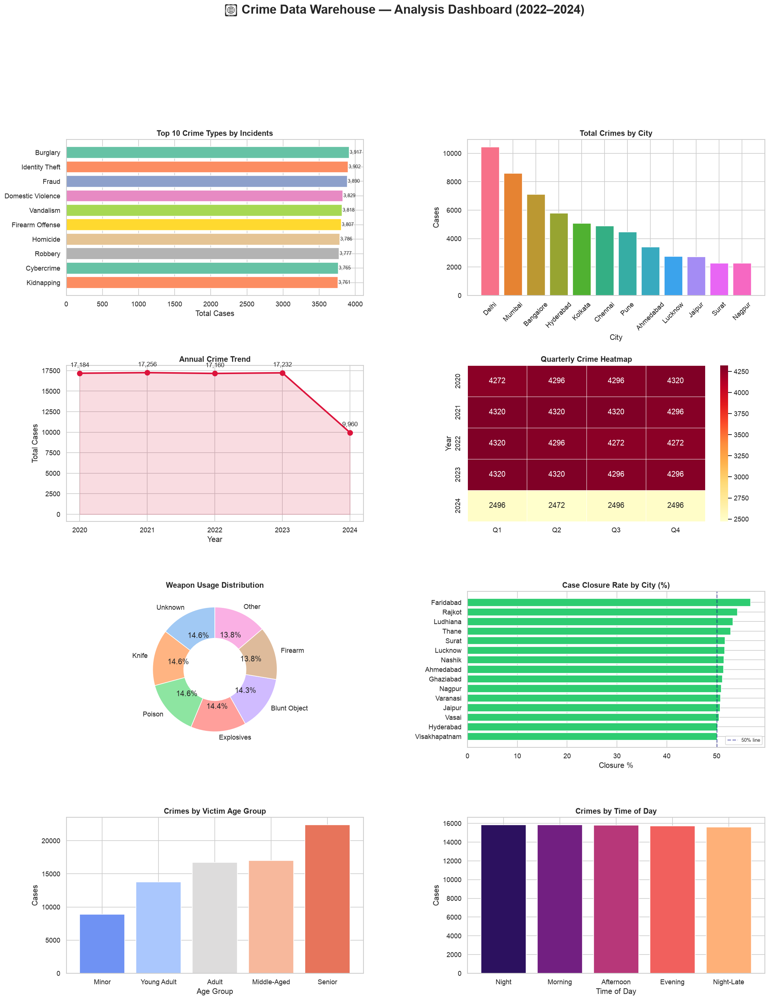
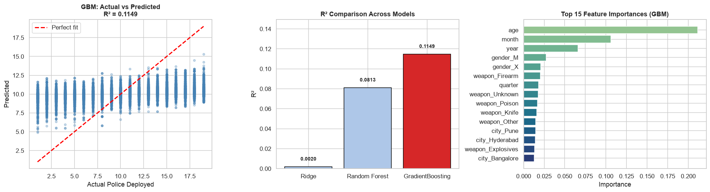
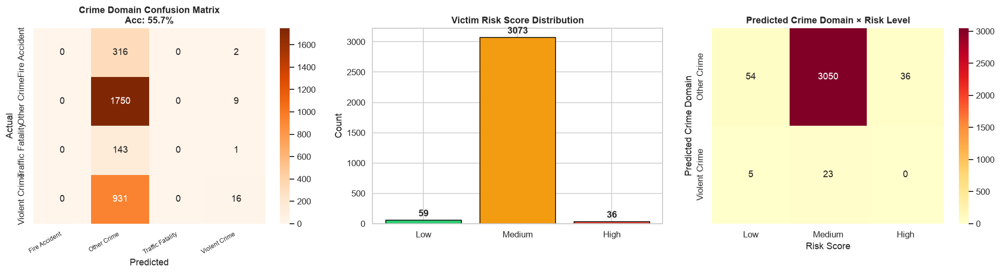

# Spatiotemporal Crime Hotspot Prediction

A system that predicts **where and when** crime hotspots are likely to emerge, combining a classical clustering baseline with a deep learning forecasting model — evaluated with rigorous, backtested comparison between the two.

---

## 📌 Overview

Most crime analysis tools identify hotspots by clustering *historical* incident locations. That shows where crime *has happened*, but treats the city as static: a region flagged as high-risk stays flagged indefinitely, regardless of whether patterns have since shifted.

This project asks a different question: **can we predict how crime patterns will evolve over the next time window, using both spatial structure (nearby regions influence each other) and temporal structure (hotspots emerge, intensify, and fade over time)?**

To answer it, the system combines a K-means clustering baseline (with a TF-IDF-based conversational interface for querying incident reports) with a ConvLSTM deep learning model that forecasts risk one week ahead, and evaluates whether the added complexity of the deep learning approach is actually worth it — with real backtested metrics, not just anecdotal improvement.

---

## 🎯 Problem Statement

Given historical crime incident records (timestamp, location, crime type), predict a **risk map for the next time window** at grid-cell resolution, and evaluate how this forecast performs against a static historical-clustering baseline at anticipating where incidents will actually occur.

This is framed as a genuine **model comparison study**, not a single model showcase — the goal is to understand *when* deep learning earns its complexity over simpler methods, and be honest about where it doesn't.

---

## 🏗️ System Components

### 1. Static Clustering Baseline
K-means clustering on historical incident coordinates produces fixed hotspot centroids. TF-IDF + cosine similarity power a chatbot interface for querying incident reports. This baseline has no notion of time — its predictions for next week are identical to its predictions for last month.

### 2. Deep Learning Forecaster — ConvLSTM
Crime data is reshaped into a spatiotemporal tensor: a sequence of weekly grids, where each cell holds incident counts (and auxiliary features like rolling averages and day-of-week distribution). A ConvLSTM — convolutional gates inside an LSTM cell — learns spatial correlation between neighboring cells *and* temporal evolution across weeks simultaneously, and outputs a predicted risk grid for the following week.

### 3. Graph Neural Network Variant (optional)
Grid cells are represented as graph nodes connected by spatial adjacency and by historical correlation in crime patterns (rather than a fixed square neighborhood). A GCRN (graph convolution + GRU) models this more flexible notion of "which regions influence which," and is compared directly against the ConvLSTM.

### 4. Learned Representations
Region identity and crime type are encoded as learned embeddings, trained jointly with the ConvLSTM rather than represented as raw counts or one-hot vectors. A t-SNE projection of the learned region embeddings is used to visually check whether regions with similar crime dynamics cluster together in embedding space — a concrete demonstration of representation learning rather than just prediction accuracy.

### 5. Evaluation Framework
All models are evaluated on a held-out, time-ordered test window (never randomly split — this is a forecasting problem, and future data must never leak into training). Metrics include:
- **Precision@K / Recall@K** — of the top-K predicted highest-risk cells, what fraction of actual incidents fell within them
- **PAI (Predictive Accuracy Index)** — rewards models that concentrate correct predictions into a small area rather than spreading risk broadly
- **Calibration** — do predicted risk scores actually correspond to real incident rates
- **Rolling backtest** — simulated week-by-week deployment across the entire test period, not a single snapshot

### 6. Conversational Interface
A chatbot answers natural-language queries such as "what's the risk forecast for [area] next week" — mapping the queried location to a grid cell, running the trained model, and returning a risk assessment alongside historical context from the baseline.

---

## 📁 Repository Structure

```
crime-hotspot-prediction/
├── data/
│   ├── raw/                      # original incident records (not committed)
│   └── processed/                # generated spatiotemporal tensors (not committed)
├── src/
│   ├── data_pipeline.py          # grid construction, weekly binning, tensor generation
│   ├── baseline.py               # K-means clustering baseline
│   ├── convlstm_model.py         # ConvLSTM architecture and training loop
│   ├── gnn_model.py              # optional GCRN variant
│   ├── embeddings.py             # learned region/crime-type embeddings
│   ├── evaluation.py             # Precision@K, Recall@K, PAI, calibration, backtest
│   └── chatbot_integration.py    # conversational risk-forecast interface
├── notebooks/
│   └── exploration_and_results.ipynb   # full walkthrough, training curves, comparison table
├── results/
│   └── comparison_table.csv
├── requirements.txt
└── README.md
```

---

## 📊 Results & Exploration

The complete analysis, model training, evaluation, and visual exploration are available in the [analysis notebook](crime_warehouse_enhanced.final..ipynb).

### 🔥 Hotspot Prediction

The spatiotemporal pipeline represents crime activity using an **8 × 8 spatial grid** across **260 weekly time steps from 2020–2024**, covering **21 crime categories**. A chronological **70% / 15% / 15% train-validation-test split** is used.

Four approaches were evaluated:

1. K-Means Baseline
2. ConvLSTM
3. GNN (GCRN)
4. Amplified ConvLSTM with Learned Embeddings

| Model | MAE ↓ | RMSE ↓ | Precision@10 ↑ | Recall@10 ↑ | PAI@10 ↑ | ECE ↓ |
|---|---:|---:|---:|---:|---:|---:|
| K-Means Baseline | 2.2603 | 5.7430 | **0.9368** | **0.8732** | **5.5886** | 4.8645 |
| ConvLSTM | 5.3644 | 7.6992 | 0.2289 | 0.2929 | 1.8746 | 2.8423 |
| GNN (GCRN) | 4.0788 | 7.1130 | 0.4026 | 0.5036 | 3.2228 | 1.7404 |
| Amplified ConvLSTM (Embeddings) | **2.0175** | **4.1983** | 0.8579 | 0.8269 | 5.2921 | **1.3158** |



### Key Findings

- **K-Means** achieved the best hotspot-ranking performance with **Precision@10 = 0.9368**, **Recall@10 = 0.8732**, and **PAI@10 = 5.5886**.
- **Amplified ConvLSTM with learned embeddings** achieved the best numerical prediction performance with **MAE = 2.0175** and **RMSE = 4.1983**.
- The embedding-enhanced ConvLSTM also achieved the lowest calibration error (**ECE = 1.3158**).
- Compared with standard ConvLSTM, the embedding-enhanced model reduced **MAE by ~62.4%**, **RMSE by ~45.5%**, and **ECE by ~53.7%**.
- **GNN (GCRN)** improved over standard ConvLSTM for hotspot ranking.

Overall, **K-Means is strongest for identifying top hotspot locations**, while the **embedding-enhanced ConvLSTM is strongest for numerical prediction accuracy and calibration**.



### 🗺️ Forecasting Examples

The forecasting pipeline generates location-specific next-week crime-risk estimates.

| Location | Grid Cell | Predicted Risk | Expected Count | Historical Average | Change |
|---|---|---|---:|---:|---:|
| Mumbai | `[2, 1]` | **Low** | 22.73 | 64.32 | −64.7% |
| Delhi | `[5, 2]` | **Low** | 18.12 | 51.12 | −64.6% |

### 🏙️ Historical Crime Volume

| Rank | City | Recorded Cases |
|---:|---|---:|
| 1 | Delhi | **10,442** |
| 2 | Mumbai | **8,592** |
| 3 | Bangalore | **7,113** |



### 👮 Police Deployment Prediction

| Model | R² Score |
|---|---:|
| Ridge Regression | 0.0020 |
| Random Forest | 0.0813 |
| **Gradient Boosting** | **0.1149** |

Gradient Boosting achieved the best test performance among the evaluated models.

- Test MSE: **26.6009**
- Test RMSE: **5.1576**
- 5-fold CV R²: **−0.0288 ± 0.0052**

The relatively low R² indicates that the current features explain only a limited portion of police deployment variation.



### ✅ Case Closure Prediction

The case closure model achieved **99.84% test accuracy**.

| Actual / Predicted | Not Closed | Closed |
|---|---:|---:|
| **Not Closed** | 7,984 | 16 |
| **Closed** | 10 | 7,749 |


The high accuracy should be interpreted carefully because some investigation-related features may introduce **temporal data leakage** if they were not available at prediction time.

### 🧑‍🤝‍🧑 Victim Risk Profiling

The victim risk model uses contextual information such as location, age, gender, and time of occurrence.

Example prediction:

| Input | Result |
|---|---|
| Location | Agra |
| Age | 30 |
| Gender | Male |
| Time | Night |
| Predicted Category | Other Crime |
| Risk Level | **Medium** |
| Risk Score | **57.8%** |

**Model Performance**

- Accuracy: **55.74%**
- Macro F1: **0.19**
- Weighted F1: **0.41**

The results show substantial class imbalance. The model performs strongly on the dominant **Other Crime** category but has limited performance on minority categories.



### 📌 Overall Results

| Component | Best Result |
|---|---|
| Hotspot Precision@10 | **K-Means — 0.9368** |
| Hotspot Recall@10 | **K-Means — 0.8732** |
| Hotspot PAI@10 | **K-Means — 5.5886** |
| Hotspot MAE | **Amplified ConvLSTM — 2.0175** |
| Hotspot RMSE | **Amplified ConvLSTM — 4.1983** |
| Hotspot Calibration | **Amplified ConvLSTM — ECE 1.3158** |
| Police Deployment | **Gradient Boosting — R² 0.1149** |
| Case Closure | **99.84% accuracy** |
| Victim Risk | **55.74% accuracy** |

### ⚠️ Important Limitations

- Crime data can contain reporting and sampling biases.
- Class imbalance affects minority-category performance.
- Case closure prediction may be affected by temporal data leakage.
- Police deployment prediction has limited explanatory power with the current features.
- Historical crime volume should not be interpreted as future crime risk.
- Spatial grid resolution can affect hotspot detection and model performance.
---

## ⚙️ Setup & Reproduction

```bash
git clone https://github.com/<your-username>/crime-hotspot-prediction.git
cd crime-hotspot-prediction
pip install -r requirements.txt
```

1. Place raw incident data in `data/raw/` (see `src/data_pipeline.py` for expected columns: `timestamp`, `latitude`, `longitude`, `crime_type`)
2. Run the data pipeline to generate processed tensors:
   ```bash
   python src/data_pipeline.py
   ```
3. Train the ConvLSTM:
   ```bash
   python src/convlstm_model.py
   ```
4. Run evaluation and generate the comparison table:
   ```bash
   python src/evaluation.py
   ```
5. Or open [`notebooks/exploration_and_results.ipynb`](notebooks/exploration_and_results.ipynb) to walk through the full pipeline interactively.

---

## 🧠 Design Decisions

- **Time-based train/val/test split, not random** — this is a forecasting task; a random split would leak future information into training and produce misleadingly optimistic results.
- **Poisson loss instead of MSE** for the ConvLSTM — targets are incident counts, and Poisson NLL is the more principled choice for count data than treating it as a continuous regression target.
- **The static baseline is kept, not discarded** — the point of this project isn't to prove deep learning wins by default, but to measure honestly where it helps and where simpler methods remain competitive.
- **Embeddings over one-hot encodings** — learning region and crime-type representations jointly with the prediction task, rather than hand-encoding them, follows a representation-learning approach that generalizes better and is directly inspectable (via the t-SNE projection).

---

## 🔭 Limitations & Future Work

- Grid resolution is a tradeoff: finer grids give more precise localization but sparser per-cell data, hurting learnability. Current resolution: *[fill in]*
- The model currently forecasts one week ahead; multi-step forecasting (predicting 2-4 weeks out) would be more operationally useful but harder to validate reliably.
- Crime data is subject to reporting bias (not all incidents are reported at equal rates across regions) — predictions reflect *reported* incident patterns, not necessarily true underlying crime rates. This is worth stating explicitly rather than implying the model measures ground truth.
- With more time/data: incorporating external features (weather, local events, socioeconomic indicators) and extending to multi-step forecasting are natural next steps.

---

## 🛠️ Tech Stack

- Python**, **PyTorch** (ConvLSTM, GNN, embeddings)
- PyTorch Geometric** (optional GNN variant)
- scikit-learn** (K-means baseline, TF-IDF)
- NumPy / Pandas** (data pipeline)
- Jupyter** (exploration and results)
